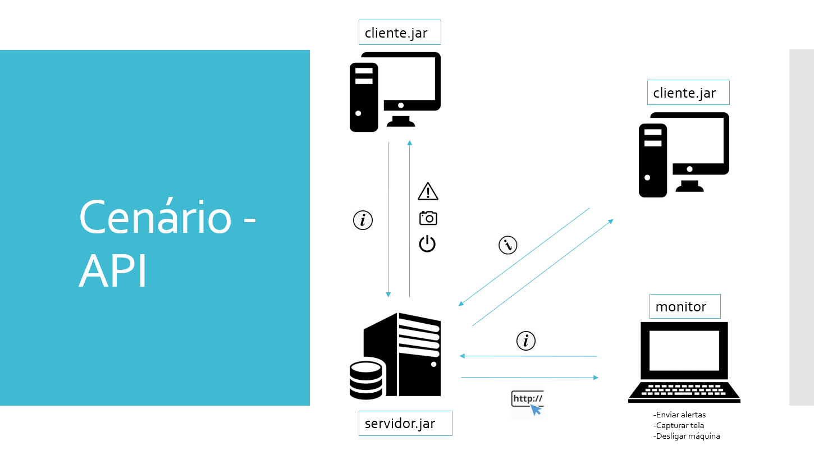

# NetworkMonitor-Client

# Network Monitor

O Network Monitor Client é a aplicação cliente do Network Monitor. Este monitora dispositivos conectados à rede, com interface web, coletando informações como IP, nome, tipo, usuário logado (quando houver), entre outras.

- [Instalação](#instalação)
- [API DOC](#api-doc)

## Instalação

Antes de realizar a instalação da aplicação é necessário tais programas para o funcionamento correto do sistema:

- JRE 8

Basta executar o [Vagrantfile](https://github.com/BelarminoM/NetworkMonitor-Client/blob/master/Vagrantfile) que o JRE será instalado e a aplicação cliente será executada.

#### Servidor
[Network Monitor](https://github.com/BelarminoM/NetworkMonitor)

#### Cliente
[Network Monitor Client](https://github.com/BelarminoM/NetworkMonitor-Client)

## Serviços

O servidor pedirá algumas informações ao cliente,além de capturar a tela, enviar alerta e um sinal para desligar a máquina. Para mais detalhes consulte a [documentação do servidor](https://github.com/BelarminoM/NetworkMonitor/blob/master/README.md).